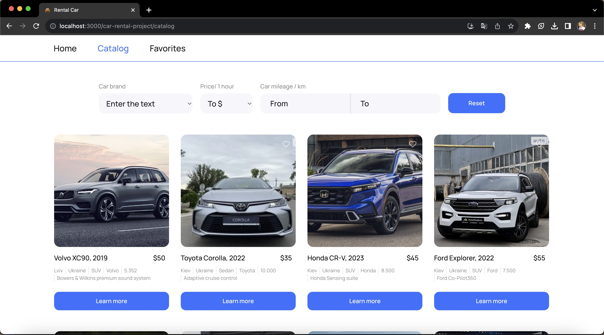

This is a web application for car rental, allowing users to search for available cars based on the brand, price, and mileage. Additionally, users can add cars to their favorites list for future reference.

Table of Contents
Introduction
Features
Technologies Used
Getting Started
Usage
Contributing
License
Introduction
Car Rental Website is a user-friendly platform that simplifies the process of finding and renting cars. Whether you're planning a trip or need a temporary vehicle, our website provides an efficient way to search for cars based on your preferences.

Features
Search Cars: Easily search for cars by brand, price range, and mileage.
Favorites: Save your favorite cars for later reference.
User-Friendly: Intuitive user interface for a seamless experience.
Technologies Used
Frontend: HTML, CSS, JavaScript, React
Backend: mockapi.io
Version Control: Git, GitHub
